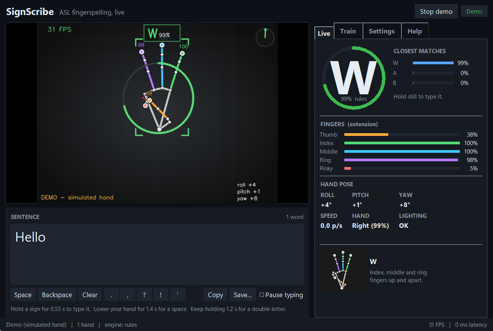

<div align="center">

# SignScribe

**Real-time ASL fingerspelling translator.** Track every joint and fingertip of your hand through a webcam,
recognise the ASL manual alphabet as you sign, and watch the sentence type itself.

[](https://github.com/fokeesy/signscribe/actions/workflows/ci.yml)




<sub>Screenshot taken in <code>--demo</code> mode: a simulated hand fingerspells <i>"hello world"</i> so the app can run without a camera.</sub>

</div>

---

## What it does

| | |
|---|---|
| **Hand tracking** | 21 landmarks per hand (wrist, every knuckle and joint, all five fingertips) from [MediaPipe Hands](https://developers.google.com/mediapipe/solutions/vision/hand_landmarker), up to two hands, left/right detection, drawn live on the video with per-finger colours. |
| **Pose analysis** | Joint flexion angles, per-finger extension, finger spread, thumb placement, hand **roll / pitch / yaw**, palm speed and direction. All of it is scale-, position- and handedness-invariant. |
| **Recognition** | The ASL alphabet **A-Z** (J and Z are recognised by their air-traced motion), plus the word signs **Hello** (wave), **Yes** (fist nod) and **I love you** (handshape). |
| **Live typing** | Hold a sign to type it. Spaces, double letters, smart capitalisation and the pronoun "I" are handled for you. Optionally type into *any other app*. |
| **Personalisation** | A guided 3-minute calibration records **your** hand and trains a small model that runs alongside the built-in rules. You can also teach it custom hand-shape words. |
| **Responsive** | Threaded low-latency capture (newest frame only), One Euro landmark filtering, roughly 20-30 ms of processing per frame on a laptop CPU (about 22 ms measured on the development machine), so a 30 FPS camera is the limit, not the software. |
| **Runs locally** | No cloud, no account, no network requests. Frames never leave your machine. |

### Skin tone, lighting and background

* **Skin tone and background.** The pipeline never segments by colour. It uses MediaPipe's palm detector and landmark network, which are trained on diverse hands and cluttered scenes, and all recognition runs on the *geometry* of the 21 landmarks, not on pixels. Nothing in this project encodes an assumption about skin colour.
* **Lighting.** A built-in exposure adapter meters **on the hand** (not the whole frame), applies auto-gamma with hysteresis, and adds CLAHE contrast enhancement when the scene is dim, over-bright, backlit or flat. If nothing is detected for a few frames it retries on an enhanced copy. The overlay is drawn with a dark under-stroke so it stays visible on any skin tone or background. The status line shows what the adapter is doing.
* **Honest caveat.** I could not measure accuracy across skin tones or lighting conditions with real people while building this, so treat the above as design intent rather than a measured guarantee, and please [open an issue](../../issues) with anything that fails for you.

## Quick start

**Requirements:** Python 3.10-3.12, a webcam, Windows / macOS / Linux (Tk is included with the standard Python installers; on Debian/Ubuntu install `python3-tk`).

```bash
git clone https://github.com/fokeesy/signscribe.git
cd signscribe
python -m venv .venv
# Windows:  .venv\Scripts\activate        macOS/Linux:  source .venv/bin/activate
pip install -e .
signscribe
```

Windows users can also double-click [`scripts/run.bat`](scripts/run.bat), which creates the virtual environment and installs everything on first run.

No camera handy? Try the built-in simulated signer:

```bash
signscribe --demo --text "hello world"
```

### Using it

1. Sit so the camera sees your hand clearly, with light on it (a lamp in front of you beats a window behind you).
2. Show a letter with the **palm toward the camera**. The big letter shows what is recognised; the ring fills as you hold it.
3. When the ring completes, the letter is typed. Change sign to continue.
4. **Space:** lower your hand out of view for about a second. **Double letter** (the "LL" in *hello*): keep holding, or drop the hand briefly and sign it again.
5. **J and Z:** make the I shape (for J) or point with your index finger (for Z), then draw the letter in the air.
6. **Word signs:** wave an open hand = *Hello*, nod a fist = *Yes*, thumb + index + little finger = *I love you*.
7. Use the buttons under the sentence for punctuation, backspace, copy and save. `Ctrl+L` clears, `F11` goes full-screen.

Every timing (hold time, space delay, confidence threshold...) is adjustable in the **Settings** tab.

### Get better accuracy: calibrate to your hand

The built-in rules describe each letter geometrically and work out of the box, but signers, cameras and hands vary. Open the **Train** tab and press *Start guided calibration*: it shows each letter, counts you in, and records about two seconds of it while you turn your hand slightly. Then press *Train model*. It takes seconds, needs no GPU, and the trained model is blended with the rules automatically. See [docs/TRAINING.md](docs/TRAINING.md).

## What it is, and what it isn't

SignScribe is a **fingerspelling** translator, the manual alphabet used to spell names and words, plus a small set of word signs. It is **not** a full ASL translator. ASL is a language with its own grammar that uses two hands, facial expression, body position and thousands of distinct signs; translating it needs large video datasets and models far beyond what this project attempts. The [roadmap](#roadmap) lists what would be needed.

**Accuracy, honestly.**

* The geometric rules were designed from anatomical descriptions of the alphabet and are checked against SignScribe's own procedural hand model (rotated, scaled, mirrored and noisy). In those checks the rules reach about **98 %** across A-Z at realistic landmark jitter (about 2 mm) and roughly **80 %** at double that jitter. That validates the *logic*; it does **not** prove accuracy on real people, because no real-signer dataset was available while developing it.
* Letters that differ only in where the thumb tucks (**A, S, T, N, M, E**) and the crossed/close finger pairs (**R vs U vs V**) are inherently hard to separate from landmarks alone. Expect confusion there until you calibrate.
* After calibration, the *held-out* accuracy shown in the Train tab is measured on frames you did not train on, but consecutive video frames are similar, so treat it as optimistic.
* MediaPipe's depth estimate is weakest when fingers point straight at the camera or are hidden behind other fingers. Keep the palm facing the lens.

## Command line

```text
signscribe [gui]        open the window (default)      --camera N  --demo  --text "..."  --video FILE
signscribe headless     print recognised text to the terminal
signscribe train        train the personal model       --images DIR  --max-per-class N  --epochs N
signscribe reference    write the reference skeleton chart to a PNG
signscribe doctor       check the installation and camera
```

Training from a folder of labelled images (`DIR/A/*.jpg`, `DIR/B/*.jpg`, ... the layout used by common public ASL-alphabet datasets) is supported: hands are detected, landmarks extracted and a model trained. See [docs/TRAINING.md](docs/TRAINING.md).

To type into other applications: `pip install "signscribe[typing]"`, then tick *Also type into other applications* in Settings and click into the target app. Keystrokes are only sent while SignScribe's own window is not focused.

## How it works

```
camera thread ──► lighting adapter ──► MediaPipe Hands ──► One Euro filter ──► HandObservation
   (newest frame)   (meter on hand,        (21 image + 21                       (image + world
                     gamma, CLAHE)           world landmarks)                     landmarks)
                                                                                     │
      ┌──────────────────────────────────────────────────────────────────────────────┤
      ▼                                                                              ▼
 invariant features                                                     motion recogniser
 (angles, extension, spread,                                            (J / Z strokes, wave, nod)
  thumb position, roll)                                                              │
      │                                                                              │
      ├─► geometry rules ─┐                                                          │
      └─► personal MLP  ──┴─► fused per-frame prediction ──► composer ◄──────────────┘
                                                      (vote → hold → re-arm → space) ──► sentence
```

A longer tour, including the feature definitions, the rule format, the composer's state machine and how to add a sign, is in [docs/ARCHITECTURE.md](docs/ARCHITECTURE.md). The reference charts are in [docs/ASL_ALPHABET.md](docs/ASL_ALPHABET.md).

## Development

```bash
pip install -e ".[dev]"
pytest                    # 130+ tests: features, rules, motion, composer, training, GUI smoke test, end to end
ruff check . && ruff format --check .
signscribe --demo         # exercises the whole stack without a camera
```

**How the tests work without a camera.** `signscribe.synthetic` is a forward-kinematics hand (palm, four three-joint fingers, an IK-solved thumb) with a pose defined for every letter. `signscribe.demo.VirtualSigner` uses it to fingerspell any text in virtual time, including traced J/Z and waves. The end-to-end tests feed that through the real engine and assert that the typed text matches, for left and right hands, with landmark noise, for a pangram containing every letter. Only the MediaPipe network is exercised separately (on real frames, with stubbed results for parsing).

Project layout:

```
src/signscribe/
  tracker.py  camera.py  preprocess.py  filters.py     perception: detection, capture, exposure, smoothing
  features.py  rules.py  model.py  recognizer.py       what shape is this hand making?
  dynamic.py  composer.py                              motion letters, and turning frames into typed text
  engine.py  overlay.py  demo.py  synthetic.py         pipeline, drawing, simulated signer
  training.py  reference.py  typing_out.py  cli.py
  gui/                                                 Tkinter application
tests/   docs/   scripts/   .github/
```

Contributions are welcome. See [CONTRIBUTING.md](CONTRIBUTING.md).

## Roadmap

Ideas, roughly in order of value:

* Validate and tune the rules against a public ASL-alphabet landmark dataset, and ship a pretrained model.
* Word suggestions / auto-complete to speed up spelling.
* Learned dynamic gestures (DTW or a small sequence model) so users can record their own moving signs.
* Two-hand and facial-expression context for real word-level signs.
* Text-to-speech output.

## Privacy

Video is processed in memory on your computer and never stored or transmitted. Recorded calibration samples contain only 21-point hand landmarks (no images) and live in your per-user data folder (`%APPDATA%\SignScribe` on Windows, `~/Library/Application Support/SignScribe` on macOS, `~/.local/share/signscribe` on Linux).

## Acknowledgements

Hand tracking by [MediaPipe](https://github.com/google/mediapipe) (Google, Apache-2.0). The one-Euro filter follows Casiez, Roussel and Vogel (CHI 2012). SignScribe is an independent project and is not affiliated with Google or any ASL organisation.

## License

[MIT](LICENSE)
