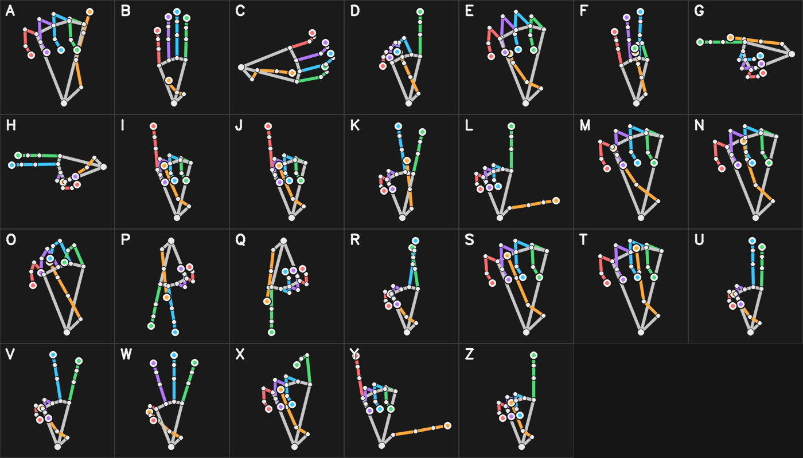

# The signs SignScribe recognises

*Schematic hand skeletons generated by `signscribe reference` from the poses in
`signscribe.synthetic`. They are approximations viewed slightly from the side, not photographs; if a
description is unclear, check a standard ASL manual-alphabet chart from a Deaf-led source.*

Sign with the **palm toward the camera** unless noted. Either hand works.

| Letter | How to sign it | Notes |
|---|---|---|
| A | Fist, thumb resting along the side of the index finger | thumb *beside*, not across |
| B | Four fingers straight up together, thumb folded across the palm | |
| C | Fingers and thumb curved into a "C" | usually held sideways |
| D | Index finger up; other fingers curl to touch the thumb | |
| E | Fingertips curled down, thumb tucked underneath | |
| F | Thumb and index touch in a circle; other three fingers up | |
| G | Index finger and thumb point sideways, parallel | hold the hand **sideways** |
| H | Index and middle fingers together, pointing sideways | hold the hand **sideways** |
| I | Fist with the little finger up | |
| **J** | Sign **I**, then draw a J in the air with the little finger | motion letter |
| K | Index and middle up in a V, thumb touching the middle finger | |
| L | Index up and thumb out, an "L" | |
| M | Fist with the thumb tucked under three fingers | hard: use calibration |
| N | Fist with the thumb tucked under two fingers | hard: use calibration |
| O | All fingertips meet the thumb, forming an "O" | |
| P | Like K, pointing **down** | |
| Q | Like G, pointing **down** | |
| R | Index and middle fingers crossed | hard: use calibration |
| S | Fist with the thumb across the front of the fingers | |
| T | Fist with the thumb poking out between index and middle | hard: use calibration |
| U | Index and middle fingers straight up, together | |
| V | Index and middle fingers up and apart | |
| W | Index, middle and ring fingers up and apart | |
| X | Index finger hooked, others in a fist | |
| Y | Thumb and little finger out | |
| **Z** | Point with the index finger and draw a Z in the air | motion letter |

Word signs:

| Sign | How |
|---|---|
| **Hello** | Wave an open hand side to side |
| **Yes** | Nod a closed fist up and down |
| **I love you** | Thumb, index finger and little finger out |

Orientation matters only where the alphabet itself depends on it: **G / H** are sideways, **P / Q**
point down, and **C** is normally sideways. Otherwise, rotate freely; recognition is rotation-,
scale- and hand-invariant.
